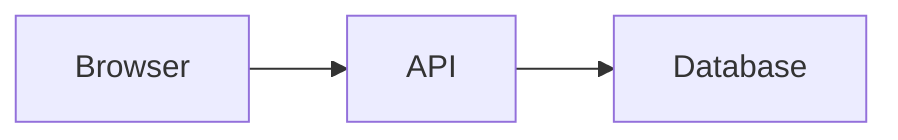

# MarkMapJournal Release 40 Dev Status

## Goal

Prepare MarkMapJournal for a future multi-context app:

- MarkMapEditor
- MarkMapJournal
- MarkMapSlides

## Current state

- App has been partially split from single-file HTML.
- CSS is currently mainly in css/app.css.
- Main JavaScript is currently mainly in js/main.js.
- HTML preview rendering has been moved to js/render/html-preview.js.
- Template data has been moved to js/data/templates-data.js.

## Current priority

Refactor file organization safely before implementing the context selector.

## Splitting Plan (refactor backlog)

Incremental JS extraction from `js/main.js` into focused modules, each loaded by
`js/app/script-loader.js`. Each split keeps `main.js` behavior intact via a thin
compatibility wrapper.

### Completed splits
- R-SPLIT1 — HTML preview rendering → `js/render/html-preview.js`
- R-SPLIT2 — Templates data → `js/data/templates-data.js`
- R-SPLIT3 — Editor visibility (hide/show + edge handle) → `js/editor/editor-visibility.js`
  - Centralized `toggleEditor()` / `hideEditor()` / `showEditor()` / `isEditorHidden()`.
  - Wires `#btnToggleEditor`, `#editorBtnHide`, `#btnEditorEdgeOpen`.
  - `body.editor-hidden` state + width save/restore preserved.
  - Added to `LOCAL_APP_SHELL` in `sw.js` (APP_VERSION bumped to `v29-editor-visibility-split`).

### Pending splits (candidates)
- Editor overlay tools panel → `js/editor/overlay-tools.js`
- Map overlay controls → `js/map/overlay-controls.js`
- Map style modifier → `js/map/style-modifier.js`
- Export (SVG / HTML) → `js/export/export-actions.js` (already partial)
- Quick-insert toolbar → `js/editor/quick-insert.js`
- Workspace panels/search/index → `js/workspace/*` (already partial)
- App context selector + sessions → `js/core/context.js` (already partial) + mode-session module

### Rules for each split
1. Create `js/<area>/<name>.js` as IIFE assigning to `window.MME_<NAME>` + `globalThis`.
2. Keep `main.js` reference working via a compatibility wrapper.
3. Register the script in `js/app/script-loader.js` load order.
4. Add new file to `LOCAL_APP_SHELL` in `sw.js` and bump `APP_VERSION`.
5. Validate with `node --check` on every touched JS file.

## Browser target

Chrome / Chromium.

## Run command

python3 -m http.server 8000

# MarkMap Multi-Context App Strategy

## Core Decision

Instead of replacing the existing MarkMapEditor with only MarkMapJournal, keep the current app and evolve it into a multi-context PWA.

The app becomes:

One app shell.
One editor/render/save/export engine.
Three operating contexts:

1. MarkMapEditor
2. MarkMapJournal
3. MarkMapSlides

This preserves the nearly complete existing app while allowing Journal and Slides workflows to grow naturally.

---

# Product Concept

## App Shell

The app keeps the existing core:

- CodeMirror editor
- Markmap renderer
- HTML preview
- Open/save workflow
- Export menu
- Dark mode
- Compact mode
- Templates
- Quick Insert
- Map overlays
- Editor overlays
- PWA behavior

The context selector changes the behavior, labels, starter content, templates, and visible controls.

---

# Contexts

## 1. MarkMapEditor

Purpose:

General-purpose Markdown to Markmap editor.

Behavior:

- Existing current behavior remains the default.
- Normal file open/save.
- General Markmap templates.
- SVG export.
- HTML preview export.
- Markdown export.
- No workspace required.
- No journal-specific logic.
- No Pandoc-first workflow.

Template button label:

Templates

Default starter markdown:

# New Mindmap

## Ideas

-

Best for:

- General thinking
- Notes
- Mindmaps
- Quick Markdown visualization

---

## 2. MarkMapJournal

Purpose:

Personal OKF journal, daily notes, concepts, tasks, and future workspace mode.

Behavior:

- Journal-oriented starter content.
- Future workspace sidebar.
- Future Today's Journal button.
- Future concepts/journals folder structure.
- Future archive instead of delete.
- Future aggregations such as Open Tasks.
- Frontmatter hidden in normal app editor.
- User tags visible in the body.
- System metadata kept in frontmatter.

Template button label:

MMJ Templates

Default starter markdown:

# Today

Tags:

## Capture

-

## Tasks

- [ ]

## Notes

Best for:

- Daily capture
- Personal knowledge base
- Meeting notes
- Project notes
- Tasks
- OKF workspace workflow

---

## 3. MarkMapSlides

Purpose:

Pandoc and presentation-oriented Markdown workflow.

Behavior:

- Pandoc templates emphasized.
- Slide deck starter content.
- Journal/workspace features hidden.
- Export Markdown/Pandoc workflow emphasized.
- Markmap rendering still available.
- HTML preview still available.
- Existing Pandoc layout transforms reused.

Template button label:

Pandoc Templates

Default starter markdown:

---

title: Presentation Title
author:
date:

---

# Title Slide

## Agenda

- Topic 1
- Topic 2

Best for:

- Presentations
- Pandoc slide decks
- Business review decks
- Structured Markdown slide authoring

---

# UI Strategy

## Add a top toolbar context selector

Recommended simple first version:

Mode: [ MarkMapEditor ▼ ]

Options:

- MarkMapEditor
- MarkMapJournal
- MarkMapSlides

Alternative visual version:

🧠 Editor | 📓 Journal | 🎞 Slides

The selector should be near the left side of the toolbar.

The top toolbar remains mostly the same.

Only labels, template button behavior, and context-specific controls change.

---

# What changes by context?

## Context affects:

- Template button label
- Template button destination
- New document starter content
- Default filename
- Sidebar visibility
- Journal controls visibility
- Slides/Pandoc controls visibility
- Initial screen / welcome content
- Export emphasis
- Future save behavior

## Context should NOT automatically destroy current content

Switching mode must not erase the active document.

Recommended behavior:

- If document is dirty, ask before switching context.
- If document is clean, switch context immediately.
- Switching context updates UI only.
- New document uses the selected context starter content.

Example:

A user is editing a MarkMapEditor file.
The user switches to MarkMapSlides.
The existing file remains untouched.
Only the UI context changes.
If the user clicks New, the new file uses the Slides starter template.

---

# Technical Model

Add a central context configuration object.

Example:

const APP_CONTEXTS = {
editor: {
id: 'editor',
label: 'MarkMap Editor',
shortLabel: 'Editor',
templateLabel: 'Templates',
defaultFileName: 'mindmap.md',
showWorkspace: false,
showJournalControls: false,
showPandocTools: false,
defaultMarkdown: `# New Mindmap

## Ideas

- `
  },

  journal: {
  id: 'journal',
  label: 'MarkMap Journal',
  shortLabel: 'Journal',
  templateLabel: 'MMJ Templates',
  defaultFileName: 'journal.md',
  showWorkspace: true,
  showJournalControls: true,
  showPandocTools: false,
  defaultMarkdown: `# Today

Tags:

## Capture

-

## Tasks

- [ ]

## Notes

`
},

slides: {
id: 'slides',
label: 'MarkMap Slides',
shortLabel: 'Slides',
templateLabel: 'Pandoc Templates',
defaultFileName: 'slides.md',
showWorkspace: false,
showJournalControls: false,
showPandocTools: true,
defaultMarkdown: `---
title: Presentation Title
author:
date:

---

# Title Slide

## Agenda

- Topic 1
- Topic 2
  `
  }
  };

Store the selected context:

let currentAppContext =
localStorage.getItem('markmap:appContext') || 'editor';

Apply context:

function applyAppContext(contextId) {
const ctx = APP_CONTEXTS[contextId] || APP_CONTEXTS.editor;

currentAppContext = ctx.id;
localStorage.setItem('markmap:appContext', ctx.id);

document.documentElement.dataset.appContext = ctx.id;

updateContextLabels(ctx);
updateContextVisibility(ctx);

log(`App context changed: ${ctx.label}`);
}

---

# Implementation Plan

## Future Architecture — Splitting and Multi-Mode State

### R-SPLIT1 — Extract Mode Session Manager
- Move mode-specific state capture/restore logic out of main.js.
- Manage editor/journal/slides state separately.
- Keep one editor instance for now.

### R-SPLIT2 — Extract Workspace Metadata/Index Parser
- Move frontmatter parsing, tag extraction, reserved tag filtering, and workspace document parsing into a dedicated module.
- Preserve frontmatter tags and body tag fallback.

### R-SPLIT3 — Extract Editor Visibility Controls
- Move editor hide/show toolbar, overlay handle, and edge open behavior into a dedicated editor UI module.
- All controls must share the same editor visibility state.

### R-SPLIT4 — Render Pipeline Stabilization
- Extract render debounce, Markmap setData, HTML refresh, and scroll sync into a render controller.
- Prevent stale overlapping renders.

### R-MULTI1 — Mode-Specific Internal State
- Maintain separate in-memory state for editor, journal, and slides.
- Preserve text/file/draft/view state per mode.
- Do not create multiple editor instances.

### R-MULTI2 — URL Mode Startup
- Support ?mode=editor, ?mode=journal, ?mode=slides.

### R-MULTI3 — Separate Current Mode Button
- Open active mode in a new window with ?mode=...&session=....

### R-MULTI4 — Session-Aware State
- Add session-specific storage keys.

### R-MULTI5 — Multi-Window Safety
- Warn about same file open in multiple windows.
- Consider BroadcastChannel.

## Roadmap — UI polish follow-ups

These items are planned for later, after archive behavior is stable.

- 7.5K — Resizable workspace sidebar
  - Allow the journal workspace sidebar to be resized.
  - Store width in localStorage.
  - Respect a practical min/max range such as 220px–420px.
  - Keep collapse/expand behavior intact.

- 7.5L — Splitter grip visuals
  - Add visible grip dots to the editor/map and map/html splitters.
  - Keep the visual treatment subtle and low-contrast.
  - Preserve current drag behavior.

- 7.5N — Concept template/header alignment with OKF
  - Use a lightweight concept starter structure with summary/notes/related/tasks sections.
  - Keep the concept body readable while metadata remains simple.
  - Defer hidden frontmatter support until a later pass.

- 7.5O — Logs panel placement
  - Keep logs controls in the panel header.
  - Preserve the current top-header action layout.
  - Leave room for a later pin/minimize option.

- 7.5M — HTML viewer overlay controls
  - Add bottom-right overlay actions for text/HTML copy and export.
  - Keep the controls compact and non-invasive.
  - Reuse the existing HTML export path.

- R-META2 — Split Metadata Templates From Body Templates
  - Keep metadata/frontmatter templates separate from body content templates.
  - Compose metadata + body at creation/insertion time.
  - Avoid duplicated frontmatter across templates.

- R-META3 — Hide Frontmatter In Editor
  - Keep frontmatter in saved Markdown files.
  - Hide/collapse it in normal editor view.
  - Add Show Metadata toggle.

- R-META4 — Metadata Panel
  - Editable metadata UI for type/date/created/updated/status/tags.
  - Tags editable as chips.
  - Save recomposes frontmatter + body.

## Phase 1 — Add Context State

1. Add `APP_CONTEXTS`.
2. Add `currentAppContext`.
3. Store selected context in localStorage.
4. Add helper functions:
   - getCurrentAppContext()
   - applyAppContext(contextId)
   - canSwitchContext()
5. Default context should be:
   - editor

---

## Phase 2 — Add Context Selector UI

1. Add a dropdown or segmented buttons to the toolbar.
2. Recommended first version:
   - dropdown, because it is simpler.
3. Example options:
   - MarkMapEditor
   - MarkMapJournal
   - MarkMapSlides
4. On change:
   - if dirty, ask user before switching.
   - if allowed, call applyAppContext(value).
5. Persist selected context.
6. On app boot, restore the last selected context.

---

## Phase 3 — Update Toolbar Labels

1. Find the existing template button.
2. Change its label based on the current context:
   - editor: Templates
   - journal: MMJ Templates
   - slides: Pandoc Templates
3. Optional:
   - update document title by context.
   - update app subtitle by context.
   - update placeholder/welcome text by context.

---

## Phase 4 — Route Template Button by Context

Template button behavior:

if context is editor:
open existing Markmap templates menu

if context is journal:
open MMJ templates menu

if context is slides:
open existing Pandoc templates menu

First version:

- Do not remove old template systems.
- Do not rewrite all template logic.
- Just route the button based on context.

Journal templates can start small:

- Daily Journal
- Meeting Note
- Project Note
- Task List
- Weekly Review

Slides mode should reuse the existing Pandoc templates.

---

## Phase 5 — Context-Specific New Document

Update `newDocument()`.

Instead of using one global starter document, use:

APP_CONTEXTS[currentAppContext].defaultMarkdown

Also set:

- editor default filename: mindmap.md
- journal default filename: journal.md
- slides default filename: slides.md

Important:

- New Document should respect dirty state.
- New Document should not affect the context.
- New Document uses the current context's starter content.

---

## Phase 6 — Context-Specific UI Visibility

Add context-specific classes or data attributes.

Recommended:

document.documentElement.dataset.appContext = currentContextId

Then CSS can target:

html[data-app-context="editor"] ...
html[data-app-context="journal"] ...
html[data-app-context="slides"] ...

Possible visibility classes:

- ctx-editor-only
- ctx-journal-only
- ctx-slides-only

Rules:

- Editor mode hides workspace/journal-specific controls.
- Journal mode shows journal/workspace controls.
- Slides mode shows Pandoc/slides controls and hides journal workspace controls.

First version can use JavaScript show/hide.
Later version can use CSS classes.

---

## Phase 7 — Journal Mode Placeholder

Do not implement full OKF Workspace immediately.

First Journal milestone:

- Context switch works.
- Journal starter document works.
- MMJ Templates button works.
- Journal label appears.
- Workspace sidebar can remain hidden or placeholder.

Later Journal features:

- Open Workspace
- Today's Journal
- Journals folder
- Concepts folder
- Hidden frontmatter
- Visible user tags
- Archive Active File
- Aggregations
- Click-to-source

---

## Phase 8 — Slides Mode Polish

Slides mode should:

- Route template button to Pandoc templates.
- Use a Pandoc starter document.
- Keep Markmap rendering.
- Keep HTML preview.
- Keep export menu.
- Emphasize Markdown/Pandoc export later.

Do not create a separate Slides app.
Reuse existing Pandoc transform/export logic.

---

## Phase 9 — Boot Behavior

On app startup:

1. Load last selected context from localStorage.
2. Apply context.
3. Wire UI.
4. Render current document.
5. If no user document/draft exists, show context-specific starter content.

Important:

- Existing drafts should not be overwritten just because context changed.
- Context persistence should not disturb current file recovery.

---

## Phase 10 — Testing

Test Editor mode:

- App boots.
- Existing starter works.
- Templates open existing Markmap templates.
- Open/save works.
- HTML preview works.
- Export works.

Test Journal mode:

- Switch to Journal.
- Label changes to MMJ Templates.
- New Document uses journal starter.
- Existing app rendering still works.
- No accidental deletion of current text.

Test Slides mode:

- Switch to Slides.
- Label changes to Pandoc Templates.
- New Document uses slide starter.
- Pandoc templates open.
- HTML preview works.
- Markdown/Pandoc export still works.

Test persistence:

- Switch to Journal.
- Reload app.
- App returns to Journal mode.
- Switch to Slides.
- Reload app.
- App returns to Slides mode.

Test dirty behavior:

- Edit text.
- Switch context.
- App asks before switching or safely preserves current document.
- Current document is not accidentally replaced.

---

# Recommended Milestones

## Milestone 1 — Three Contexts Basic

Goal:

- Context selector exists.
- Context persists.
- Toolbar template label changes.
- New document starter changes.
- Template button routes by context.

Estimated time:

0.5 to 1.5 days.

---

## Milestone 2 — Journal Templates

Goal:

- MMJ templates menu exists.
- Daily Journal template.
- Meeting template.
- Project template.
- Task List template.
- Weekly Review template.

Estimated time:

0.5 to 1 day.

---

## Milestone 3 — Slides Polish

Goal:

- Slides context defaults to Pandoc templates.
- Slides starter improved.
- Export menu emphasizes Pandoc Markdown.
- Existing Pandoc workflow remains stable.

Estimated time:

0.5 to 1 day.

---

## Milestone 7 — Journal Workspace Alpha ✅

- Journal sidebar visible in Journal mode
- Open Workspace works
- Required folders created
- Today opens/creates journals/YYYY-MM-DD.md
- Save overwrites active workspace file
- Editor/Journal/Slides context switching works

---

## Milestone 5 — OKF Journal System

Goal:

- Hidden frontmatter.
- Visible user tags.
- Today's Journal.
- New Concept templates.
- Archive Active File.
- Open Tasks aggregation.
- Click-to-source.
- Back to aggregation.

Estimated time:

1 to 3 weeks depending on polish.

---

# Recommended Branches

main
Stable baseline.

dev/release-40-okf-workspace
Development integration branch.

feature/app-contexts
Add Editor / Journal / Slides context selector.

feature/workspace-alpha
Add Journal workspace sidebar and scanner.

feature/okf-frontmatter
Add hidden frontmatter and visible tags.

feature/aggregations
Add Open Tasks aggregation and click-to-source.

Recommended first branch:

feature/app-contexts

---

# Difficulty

This change is viable and moderate difficulty.

It is safer than replacing the whole app.

Why it is safe:

- Existing app remains mostly intact.
- Core editor/render/save/export engine is reused.
- Contexts are mostly configuration at first.
- Journal and Slides can grow gradually.
- Context switch does not erase current document.

Estimated time:

Basic context switch:
2 to 4 days including testing.

Full polished three-context workflow:
1 to 2 weeks.

Full Journal OKF workspace:
2 to 6 weeks depending on scope.

---

# Key Rule

Do not build three separate apps.

Build one app with three contexts.

One engine.
Three modes.
Shared editor.
Shared Markmap renderer.
Shared file/export system.
Context-specific templates, starter content, labels, and controls.

This preserves existing work and creates a flexible future path.

---

# Diagram Support Track

## Purpose

Improve MarkmapEditor / MarkMapJournal / MarkMapSlides with text-based and editable diagram support.

This track should support:

- Mermaid diagrams directly in Markdown.
- Draw.io editable diagram assets.
- Editable SVG diagrams with embedded Draw.io XML.
- Optional PlantUML later.

This track benefits all app modes:

- Editor: standalone diagram-rich Markdown/mindmaps.
- Journal: architecture notes, product notes, process notes, concept pages.
- Slides: diagrams for Pandoc/presentation workflows.

---

## Priority Order

Preferred implementation order:

1. Mermaid Support
2. Draw.io Asset Support (.drawio + .svg)
3. Editable Draw.io SVG Support
4. PlantUML Support, optional later

---

## Stage D1 — Mermaid Support

### Priority: HIGH

Goal:
Allow Mermaid diagrams directly inside Markdown.

Supported syntax:



Required features:

- Render Mermaid blocks in HTML Preview.
- Export Mermaid diagrams correctly in HTML export.
- Support dark/light mode.
- Avoid external asset files.
- Keep diagrams text-based and Git-friendly.
- Keep diagrams AI-friendly.

Optional features:

- Export Mermaid diagram as SVG.
- Render Mermaid diagram inside Markmap nodes if feasible.
- Copy Mermaid SVG from preview.

Implementation notes:

- Detect fenced code blocks with language `mermaid`.
- In HTML Preview, replace Mermaid code block output with a Mermaid-rendered diagram container.
- In standalone HTML export, include Mermaid runtime or pre-rendered SVG.
- Ensure dark/light theme is passed into Mermaid rendering.
- Do not break existing Shiki code highlighting.
- Do not rewrite Markmap rendering for initial Mermaid support.

Acceptance tests:

- A Markdown file containing a Mermaid block renders correctly in HTML Preview.
- HTML export includes rendered Mermaid diagrams.
- Dark mode and light mode are readable.
- Non-Mermaid code blocks still use existing syntax highlighting.
- Existing Markdown, Markmap, and HTML preview behavior remains stable.

Benefits:

- Text based.
- Git friendly.
- AI friendly.
- No external asset files.
- Good for flowcharts, architecture diagrams, process diagrams, and documentation.

---

## Stage D2 — Draw.io Asset Support

### Priority: MEDIUM

Goal:
Support editable architecture and business diagrams using Draw.io-compatible assets.

Recommended workspace structure:

```
assets/
  network.drawio
  network.svg
```

Markdown usage:

```
./assets/network.svg
```

Required features:

- Display SVG in HTML Preview.
- Display SVG in Markmap when referenced as an image.
- Detect when an SVG has a matching `.drawio` source file.
- Double-click diagram/image to open editing workflow.
- Refresh SVG after save.

Expected lookup behavior:

- User references:

  `./assets/network.svg`

- App checks for matching source:

  `./assets/network.drawio`

- If matching .drawio exists:
  - Open Draw.io editor or editing workflow.
  - Allow user to update diagram.
  - Refresh SVG output after save.

Implementation notes:

- Start with display support only.
- Then add double-click detection.
- Do not block normal image rendering.
- Do not require every SVG to have a .drawio source.
- Use assets/ as preferred folder.
- Integrate with existing image workflow.
- Keep Markdown reference simple.

Acceptance tests:

- Markdown image/reference to `./assets/network.svg` displays in HTML Preview.
- Same SVG displays in Markmap if current image rendering supports SVG.
- Double-clicking SVG attempts to locate `./assets/network.drawio`.
